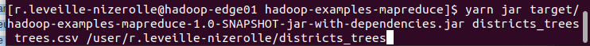
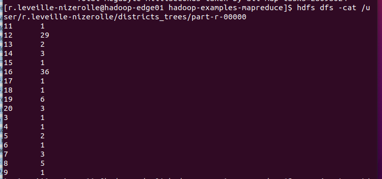
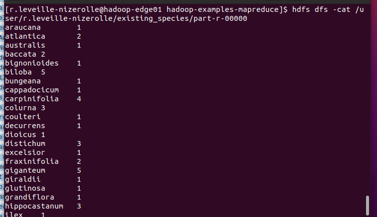
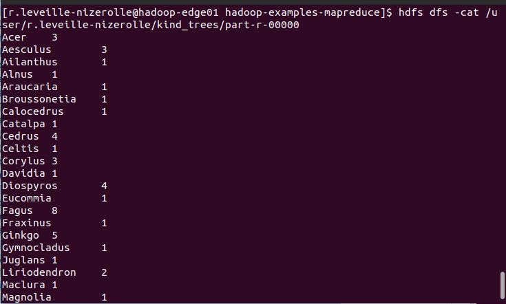
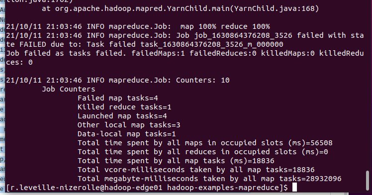

# LAB_2 YARN & MAPREDUCE 2

# 1 MapReduce JAVA

Before begin, I need to install some prerequirements which are :OpenJDK, Git gui, Intellij IDEA.

Then, I download the java project and use IntelliJDK to get a jar file from it.

Then, I need to send this jar file to the edge using 
```bash 

scp hadoop-examples-mapreduce/target/hadoop-examples-mapreduce-1.0-SNAPSHOT-jar-with-dependencies.jar r.leveille-nizerolle@hadoop-edge01.efrei.online:/home/r.leveille-nizerolle

```

After that, I can start the wordcount job with this command :

```bash
yarn jar hadoop-examples-mapreduce-1.0-SNAPSHOT-jar-with-dependencies.jar wordcount

```
To be easier, it's better to use FileZilla on Windows, so it's what I will do for the Lab.

Now, I can begin the exercises:

## 1.8 Remarkable trees of Paris

### 1.8.1 Districts containing trees

Write a MapReduce job that displays the list of distinct containing trees in this
file.

To launch my program, I do the command :


Then, to see the result I do :


We can see that the distincts districts a between 3 and 20.

### 1.8.2 Show all existing species
  
Write a MapReduce job that displays the list of different species trees in this
file.



With this command, we can see all the differents species.

### 1.8.3 Number of trees by kinds

Write a MapReduce job that calculates the number of trees of each kinds.



### 1.8.4 Maximum height per kind of tree

Write an MapReduce job that calculates the height of the tallest tree of each
kind.

I didn't succed this exercise, but I tried something and I get this error :

